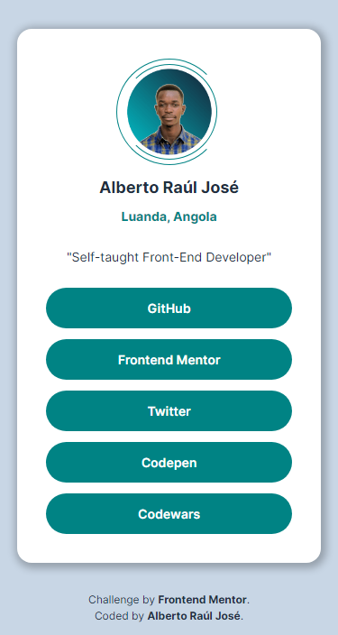
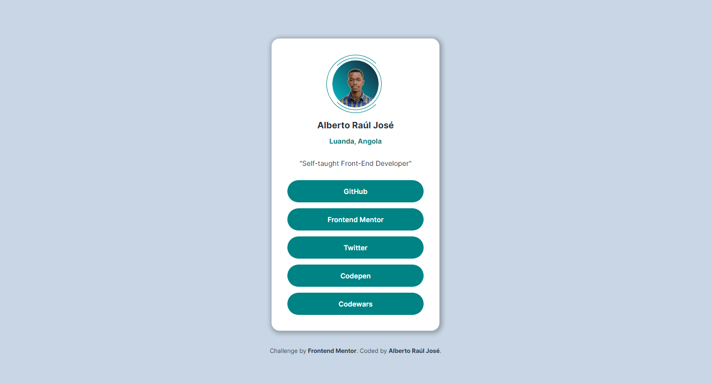

# Frontend Mentor - Social links profile solution

This is a solution to the [Social links profile challenge on Frontend Mentor](https://www.frontendmentor.io/challenges/social-links-profile-UG32l9m6dQ). Frontend Mentor challenges help you improve your coding skills by building realistic projects.

## Table of contents

- [Overview](#overview)
  - [The challenge](#the-challenge)
  - [Screenshot](#screenshot)
  - [Links](#links)
- [My process](#my-process)
  - [Built with](#built-with)
- [Author](#author)

## Overview

### The challenge

Users should be able to:

- See hover and focus states for all interactive elements on the page

### Screenshot

  
Mobile version

  

  
Desktop version

  

### Links

- Solution URL: [Repository](https://your-solution-url.com)
- Live Site URL: [Demo](https://alberto-rj.github.io/social-links-profile/)

## My process

### Built with

- Semantic HTML5 markup
- CSS custom properties
- Flexbox
- Mobile-first workflow

## Author

- Github - [Alberto Raúl José](https://github.com/alberto-rj)
- Frontend Mentor - [@alberto-rj](https://www.frontendmentor.io/profile/alberto-rj)
- Twitter - [@albertorauljose](https://www.twitter.com/albertorauljose)
